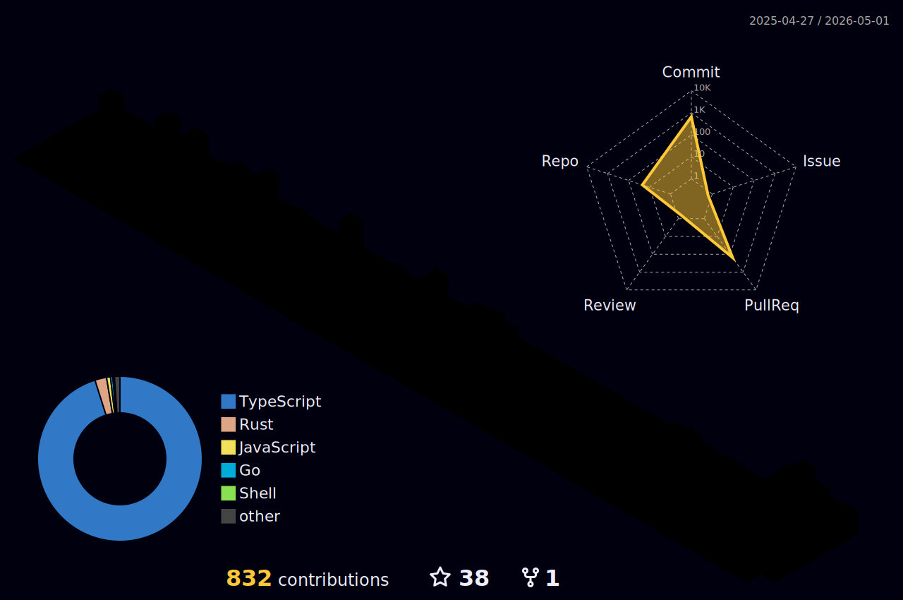

<h1 align="center"> :boar: Hi, I'm MidSeeLee :boar:</h1>
 
<!--START_SECTION:waka-->


**🐱 My GitHub Data** 

> 📦 96.8 kB Used in GitHub's Storage 
 > 
> 🏆 140 Contributions in the Year 2025
 > 
> 💼 Opted to Hire
 > 
> 📜 129 Public Repositories 
 > 
> 🔑 10 Private Repositories 
 > 
**I'm a Night 🦉** 

```text
🌞 Morning                1948 commits        █████░░░░░░░░░░░░░░░░░░░░   20.66 % 
🌆 Daytime                1677 commits        ████░░░░░░░░░░░░░░░░░░░░░   17.79 % 
🌃 Evening                5455 commits        ██████████████░░░░░░░░░░░   57.87 % 
🌙 Night                  347 commits         █░░░░░░░░░░░░░░░░░░░░░░░░   03.68 % 
```
📅 **I'm Most Productive on Sunday** 

```text
Monday                   1731 commits        █████░░░░░░░░░░░░░░░░░░░░   18.36 % 
Tuesday                  1424 commits        ████░░░░░░░░░░░░░░░░░░░░░   15.11 % 
Wednesday                1343 commits        ████░░░░░░░░░░░░░░░░░░░░░   14.25 % 
Thursday                 976 commits         ███░░░░░░░░░░░░░░░░░░░░░░   10.35 % 
Friday                   695 commits         ██░░░░░░░░░░░░░░░░░░░░░░░   07.37 % 
Saturday                 1401 commits        ████░░░░░░░░░░░░░░░░░░░░░   14.86 % 
Sunday                   1857 commits        █████░░░░░░░░░░░░░░░░░░░░   19.70 % 
```


📊 **This Week I Spent My Time On** 

```text
🕑︎ Time Zone: Asia/Bangkok

💬 Programming Languages: 
JavaScript               18 hrs 31 mins      ███████████░░░░░░░░░░░░░░   44.26 % 
TypeScript               13 hrs 15 mins      ████████░░░░░░░░░░░░░░░░░   31.68 % 
JSON                     2 hrs 45 mins       ██░░░░░░░░░░░░░░░░░░░░░░░   06.58 % 
Docker                   2 hrs 21 mins       █░░░░░░░░░░░░░░░░░░░░░░░░   05.63 % 
YAML                     1 hr 3 mins         █░░░░░░░░░░░░░░░░░░░░░░░░   02.51 % 

💻 Operating System: 
Mac                      41 hrs 51 mins      █████████████████████████   100.00 % 
```


 Last Updated on 09/06/2025 17:07:55 UTC
<!--END_SECTION:waka-->

##



## Familiar with:
- JavaScript / TypeScript
- Flutter / Dart

## In domains of:
- Frontend Web
  - React / Next.js
  - Angular
- Backend Web
  - Node: Express / Nest.js / Meteor
  - Python: Flask
  - JAVA : Spring Boot
- Mobile
  - Cross Platform: Flutter
- Database
  - SQL: MySQL/ MariaDb / Postgres
  - NoSQL: MongoDB
  - ORM: Prisma / Mongoose
