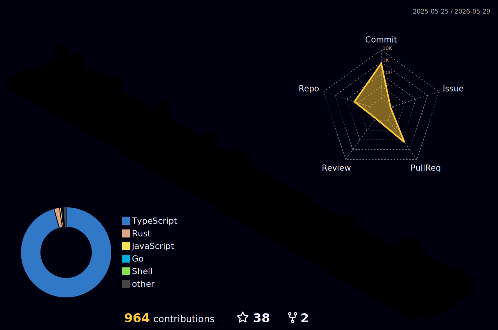

<h1 align="center"> :boar: Hi, I'm MidSeeLee :boar:</h1>
 
<!--START_SECTION:waka-->


**🐱 My GitHub Data** 

> 📦 109.1 kB Used in GitHub's Storage 
 > 
> 🏆 44 Contributions in the Year 2026
 > 
> 💼 Opted to Hire
 > 
> 📜 144 Public Repositories 
 > 
> 🔑 10 Private Repositories 
 > 
**I'm a Night 🦉** 

```text
🌞 Morning                3441 commits        ███████░░░░░░░░░░░░░░░░░░   26.78 % 
🌆 Daytime                2510 commits        █████░░░░░░░░░░░░░░░░░░░░   19.53 % 
🌃 Evening                6524 commits        █████████████░░░░░░░░░░░░   50.77 % 
🌙 Night                  376 commits         █░░░░░░░░░░░░░░░░░░░░░░░░   02.93 % 
```
📅 **I'm Most Productive on Sunday** 

```text
Monday                   2162 commits        ████░░░░░░░░░░░░░░░░░░░░░   16.82 % 
Tuesday                  1814 commits        ████░░░░░░░░░░░░░░░░░░░░░   14.12 % 
Wednesday                1631 commits        ███░░░░░░░░░░░░░░░░░░░░░░   12.69 % 
Thursday                 1333 commits        ███░░░░░░░░░░░░░░░░░░░░░░   10.37 % 
Friday                   1161 commits        ██░░░░░░░░░░░░░░░░░░░░░░░   09.03 % 
Saturday                 2176 commits        ████░░░░░░░░░░░░░░░░░░░░░   16.93 % 
Sunday                   2574 commits        █████░░░░░░░░░░░░░░░░░░░░   20.03 % 
```


📊 **This Week I Spent My Time On** 

```text
🕑︎ Time Zone: Asia/Bangkok

💬 Programming Languages: 
TypeScript               1 hr 43 mins        ████████████████░░░░░░░░░   64.24 % 
Markdown                 43 mins             ███████░░░░░░░░░░░░░░░░░░   26.94 % 
Other                    9 mins              ██░░░░░░░░░░░░░░░░░░░░░░░   06.08 % 
JSON                     4 mins              █░░░░░░░░░░░░░░░░░░░░░░░░   02.70 % 
Prisma                   0 secs              ░░░░░░░░░░░░░░░░░░░░░░░░░   00.03 % 

🔥 Editors: 
Cursor                   2 hrs 41 mins       █████████████████████████   99.97 % 
Zed                      0 secs              ░░░░░░░░░░░░░░░░░░░░░░░░░   00.03 % 

💻 Operating System: 
Mac                      2 hrs 41 mins       █████████████████████████   100.00 % 
```


 Last Updated on 10/03/2026 17:21:47 UTC
<!--END_SECTION:waka-->

##



## Familiar with:
- JavaScript / TypeScript
- Flutter / Dart

## In domains of:
- Frontend Web
  - React / Next.js
  - Angular
- Backend Web
  - Node: Express / Nest.js / Meteor
  - Python: Flask
  - JAVA : Spring Boot
- Mobile
  - Cross Platform: Flutter
- Database
  - SQL: MySQL/ MariaDb / Postgres
  - NoSQL: MongoDB
  - ORM: Prisma / Mongoose
