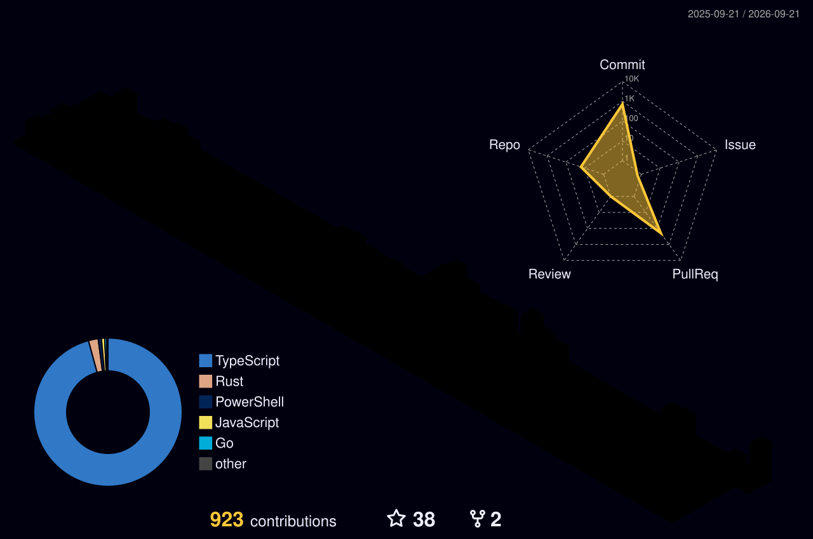

<h1 align="center"> :boar: Hi, I'm MidSeeLee :boar:</h1>
 
<!--START_SECTION:waka-->


**🐱 My GitHub Data** 

> 📦 121.8 kB Used in GitHub's Storage 
 > 
> 🏆 712 Contributions in the Year 2026
 > 
> 💼 Opted to Hire
 > 
> 📜 149 Public Repositories 
 > 
> 🔑 11 Private Repositories 
 > 
**I'm an Early 🐤** 

```text
🌞 Morning                16889 commits       ████████░░░░░░░░░░░░░░░░░   31.35 % 
🌆 Daytime                10895 commits       █████░░░░░░░░░░░░░░░░░░░░   20.22 % 
🌃 Evening                24725 commits       ███████████░░░░░░░░░░░░░░   45.89 % 
🌙 Night                  1367 commits        █░░░░░░░░░░░░░░░░░░░░░░░░   02.54 % 
```
📅 **I'm Most Productive on Sunday** 

```text
Monday                   8623 commits        ████░░░░░░░░░░░░░░░░░░░░░   16.01 % 
Tuesday                  6900 commits        ███░░░░░░░░░░░░░░░░░░░░░░   12.81 % 
Wednesday                6100 commits        ███░░░░░░░░░░░░░░░░░░░░░░   11.32 % 
Thursday                 4982 commits        ██░░░░░░░░░░░░░░░░░░░░░░░   09.25 % 
Friday                   4612 commits        ██░░░░░░░░░░░░░░░░░░░░░░░   08.56 % 
Saturday                 11052 commits       █████░░░░░░░░░░░░░░░░░░░░   20.51 % 
Sunday                   11607 commits       █████░░░░░░░░░░░░░░░░░░░░   21.54 % 
```


📊 **This Week I Spent My Time On** 

```text
🕑︎ Time Zone: Asia/Bangkok

💬 Programming Languages: 
JavaScript               9 hrs 11 mins       ████████████░░░░░░░░░░░░░   49.44 % 
HTML                     3 hrs 20 mins       █████░░░░░░░░░░░░░░░░░░░░   18.02 % 
Markdown                 1 hr 25 mins        ██░░░░░░░░░░░░░░░░░░░░░░░   07.66 % 
TypeScript               1 hr 24 mins        ██░░░░░░░░░░░░░░░░░░░░░░░   07.56 % 
Other                    1 hr 20 mins        ██░░░░░░░░░░░░░░░░░░░░░░░   07.20 % 

🔥 Editors: 
Codex Vscode             10 hrs 6 mins       ██████████████░░░░░░░░░░░   54.43 % 
Zed                      7 hrs 25 mins       ██████████░░░░░░░░░░░░░░░   39.96 % 
Cursor                   28 mins             █░░░░░░░░░░░░░░░░░░░░░░░░   02.57 % 
Claude Code              20 mins             ░░░░░░░░░░░░░░░░░░░░░░░░░   01.84 % 
Antigravity CLI          13 mins             ░░░░░░░░░░░░░░░░░░░░░░░░░   01.21 % 

💻 Operating System: 
Mac                      18 hrs 34 mins      █████████████████████████   100.00 % 
```

🤖 **AI Coding This Week** 

```text
⏱ AI Coding Time: 17 hrs 30 mins (94.27%)

✍️ 1,777 lines written by AI, 0 lines written by hand (100.0% AI-written)

🔤 139,508,250 Input Tokens, 2,837,411 Output Tokens

💵 $698.60 Estimated AI Cost This Week

🧠 42 AI Sessions, 366 AI Prompts

GPT                      1,811 lines         █████████████████████████   98.21 % 
Opencode-Cli             33 lines            ░░░░░░░░░░░░░░░░░░░░░░░░░   01.79 % 
GLM                      0 lines             ░░░░░░░░░░░░░░░░░░░░░░░░░   00.00 % 
ZCode                    0 lines             ░░░░░░░░░░░░░░░░░░░░░░░░░   00.00 % 
Composer                 0 lines             ░░░░░░░░░░░░░░░░░░░░░░░░░   00.00 % 

🔎 AI Coding Insights:
🤖 AI-Driven — 100.0% of written lines came from AI
📚 Verbose Prompter — average 5,469 characters per prompt
🔁 Iterative Prompter — average 9 prompts per session
🚀 High AI Trust — 0.43% of changed lines were hand-edited
```


 Last Updated on 25/08/2026 17:40:33 UTC
<!--END_SECTION:waka-->

##



## Familiar with:
- JavaScript / TypeScript
- Flutter / Dart

## In domains of:
- Frontend Web
  - React / Next.js
  - Angular
- Backend Web
  - Node: Express / Nest.js / Meteor
  - Python: Flask
  - JAVA : Spring Boot
- Mobile
  - Cross Platform: Flutter
- Database
  - SQL: MySQL/ MariaDb / Postgres
  - NoSQL: MongoDB
  - ORM: Prisma / Mongoose
