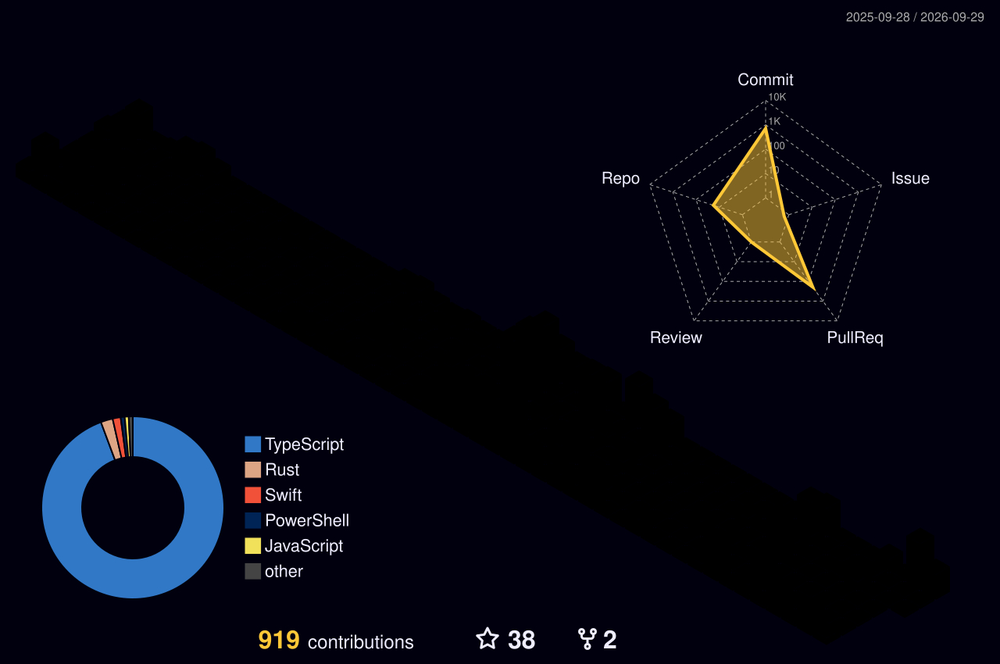

<h1 align="center"> :boar: Hi, I'm MidSeeLee :boar:</h1>
 
<!--START_SECTION:waka-->


**🐱 My GitHub Data** 

> 📦 167.8 kB Used in GitHub's Storage 
 > 
> 🏆 847 Contributions in the Year 2026
 > 
> 💼 Opted to Hire
 > 
> 📜 153 Public Repositories 
 > 
> 🔑 11 Private Repositories 
 > 
**I'm an Early 🐤** 

```text
🌞 Morning                20217 commits       ████████░░░░░░░░░░░░░░░░░   30.79 % 
🌆 Daytime                14904 commits       ██████░░░░░░░░░░░░░░░░░░░   22.70 % 
🌃 Evening                28844 commits       ███████████░░░░░░░░░░░░░░   43.93 % 
🌙 Night                  1690 commits        █░░░░░░░░░░░░░░░░░░░░░░░░   02.57 % 
```
📅 **I'm Most Productive on Saturday** 

```text
Monday                   9409 commits        ████░░░░░░░░░░░░░░░░░░░░░   14.33 % 
Tuesday                  7851 commits        ███░░░░░░░░░░░░░░░░░░░░░░   11.96 % 
Wednesday                6674 commits        ███░░░░░░░░░░░░░░░░░░░░░░   10.17 % 
Thursday                 5813 commits        ██░░░░░░░░░░░░░░░░░░░░░░░   08.85 % 
Friday                   5693 commits        ██░░░░░░░░░░░░░░░░░░░░░░░   08.67 % 
Saturday                 16103 commits       ██████░░░░░░░░░░░░░░░░░░░   24.53 % 
Sunday                   14112 commits       █████░░░░░░░░░░░░░░░░░░░░   21.49 % 
```


📊 **This Week I Spent My Time On** 

```text
🕑︎ Time Zone: Asia/Bangkok

💬 Programming Languages: 
TypeScript               16 hrs 28 mins      ████████████░░░░░░░░░░░░░   46.86 % 
Markdown                 7 hrs 47 mins       ██████░░░░░░░░░░░░░░░░░░░   22.15 % 
Other                    4 hrs 8 mins        ███░░░░░░░░░░░░░░░░░░░░░░   11.76 % 
JSON                     2 hrs 13 mins       ██░░░░░░░░░░░░░░░░░░░░░░░   06.31 % 
shell script             1 hr 4 mins         █░░░░░░░░░░░░░░░░░░░░░░░░   03.07 % 

🔥 Editors: 
Claude Code              13 hrs 10 mins      █████████░░░░░░░░░░░░░░░░   37.46 % 
Codex Vscode             9 hrs 44 mins       ███████░░░░░░░░░░░░░░░░░░   27.73 % 
ZCode                    7 hrs 6 mins        █████░░░░░░░░░░░░░░░░░░░░   20.24 % 
Zed                      2 hrs 13 mins       ██░░░░░░░░░░░░░░░░░░░░░░░   06.32 % 
Bot                      2 hrs 2 mins        █░░░░░░░░░░░░░░░░░░░░░░░░   05.79 % 

💻 Operating System: 
Mac                      35 hrs 9 mins       █████████████████████████   100.00 % 
```

🤖 **AI Coding This Week** 

```text
⏱ AI Coding Time: 33 hrs 41 mins (95.86%)

✍️ 38,848 lines written by AI, 398 lines written by hand (98.99% AI-written)

🔤 30,368,454 Input Tokens, 5,039,921 Output Tokens

💵 $915.13 Estimated AI Cost This Week

🧠 139 AI Sessions, 751 AI Prompts

ZCode                    26,370 lines        ████████████████░░░░░░░░░   65.06 % 
GPT                      12,272 lines        ████████░░░░░░░░░░░░░░░░░   30.28 % 
Opus                     1,069 lines         █░░░░░░░░░░░░░░░░░░░░░░░░   02.64 % 
Sonnet                   819 lines           █░░░░░░░░░░░░░░░░░░░░░░░░   02.02 % 
GLM                      0 lines             ░░░░░░░░░░░░░░░░░░░░░░░░░   00.00 % 

🔎 AI Coding Insights:
🤖 AI-Driven — 98.99% of written lines came from AI
📚 Verbose Prompter — average 1,983 characters per prompt
🔁 Iterative Prompter — average 5 prompts per session
🚀 High AI Trust — 7.59% of changed lines were hand-edited
```


 Last Updated on 07/10/2026 22:01:53 UTC
<!--END_SECTION:waka-->

##



## Familiar with:
- JavaScript / TypeScript
- Flutter / Dart

## In domains of:
- Frontend Web
  - React / Next.js
  - Angular
- Backend Web
  - Node: Express / Nest.js / Meteor
  - Python: Flask
  - JAVA : Spring Boot
- Mobile
  - Cross Platform: Flutter
- Database
  - SQL: MySQL/ MariaDb / Postgres
  - NoSQL: MongoDB
  - ORM: Prisma / Mongoose
