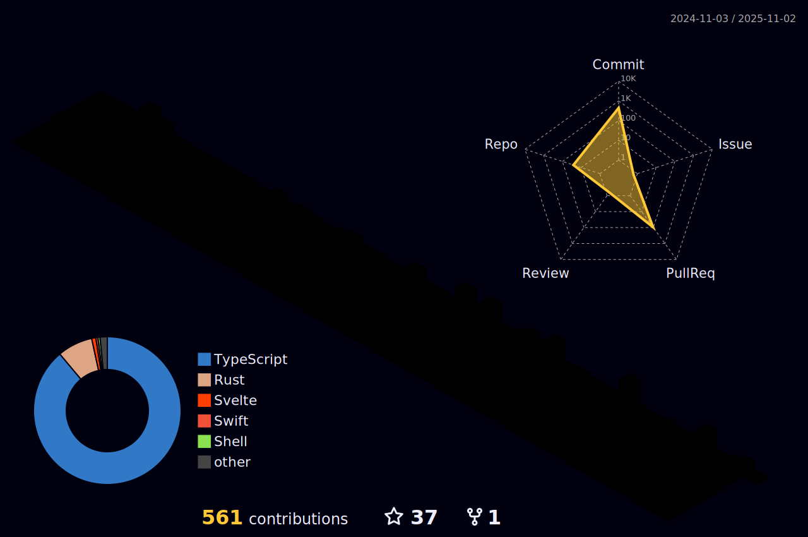

<h1 align="center"> :boar: Hi, I'm MidSeeLee :boar:</h1>
 
<!--START_SECTION:waka-->


**🐱 My GitHub Data** 

> 📦 74.5 kB Used in GitHub's Storage 
 > 
> 🏆 629 Contributions in the Year 2023
 > 
> 💼 Opted to Hire
 > 
> 📜 79 Public Repositories 
 > 
> 🔑 9 Private Repositories 
 > 
**I'm an Early 🐤** 

```text
🌞 Morning                2263 commits        █████░░░░░░░░░░░░░░░░░░░░   19.78 % 
🌆 Daytime                6733 commits        ███████████████░░░░░░░░░░   58.85 % 
🌃 Evening                2253 commits        █████░░░░░░░░░░░░░░░░░░░░   19.69 % 
🌙 Night                  191 commits         ░░░░░░░░░░░░░░░░░░░░░░░░░   01.67 % 
```
📅 **I'm Most Productive on Thursday** 

```text
Monday                   2039 commits        ████░░░░░░░░░░░░░░░░░░░░░   17.82 % 
Tuesday                  1996 commits        ████░░░░░░░░░░░░░░░░░░░░░   17.45 % 
Wednesday                2021 commits        ████░░░░░░░░░░░░░░░░░░░░░   17.67 % 
Thursday                 2779 commits        ██████░░░░░░░░░░░░░░░░░░░   24.29 % 
Friday                   1843 commits        ████░░░░░░░░░░░░░░░░░░░░░   16.11 % 
Saturday                 265 commits         █░░░░░░░░░░░░░░░░░░░░░░░░   02.32 % 
Sunday                   497 commits         █░░░░░░░░░░░░░░░░░░░░░░░░   04.34 % 
```


📊 **This Week I Spent My Time On** 

```text
🕑︎ Time Zone: Asia/Bangkok

💬 Programming Languages: 
JavaScript               32 hrs 1 min        █████████████████████░░░░   83.42 % 
TypeScript               5 hrs 23 mins       ████░░░░░░░░░░░░░░░░░░░░░   14.06 % 
JSON                     53 mins             █░░░░░░░░░░░░░░░░░░░░░░░░   02.34 % 
Makefile                 2 mins              ░░░░░░░░░░░░░░░░░░░░░░░░░   00.12 % 
HTML                     1 min               ░░░░░░░░░░░░░░░░░░░░░░░░░   00.06 % 

💻 Operating System: 
Mac                      38 hrs 23 mins      █████████████████████████   100.00 % 
```


 Last Updated on 21/07/2023 17:13:30 UTC
<!--END_SECTION:waka-->

##



## Familiar with:
- JavaScript / TypeScript
- Flutter / Dart

## In domains of:
- Frontend Web
  - React / Next.js
  - Angular
- Backend Web
  - Node: Express / Nest.js / Meteor
  - Python: Flask
  - JAVA : Spring Boot
- Mobile
  - Cross Platform: Flutter
- Database
  - SQL: MySQL/ MariaDb / Postgres
  - NoSQL: MongoDB
  - ORM: Prisma / Mongoose
